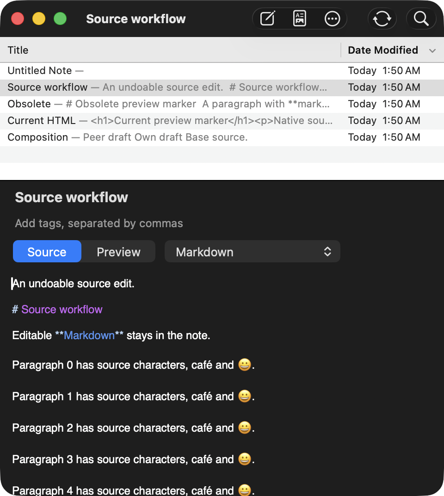
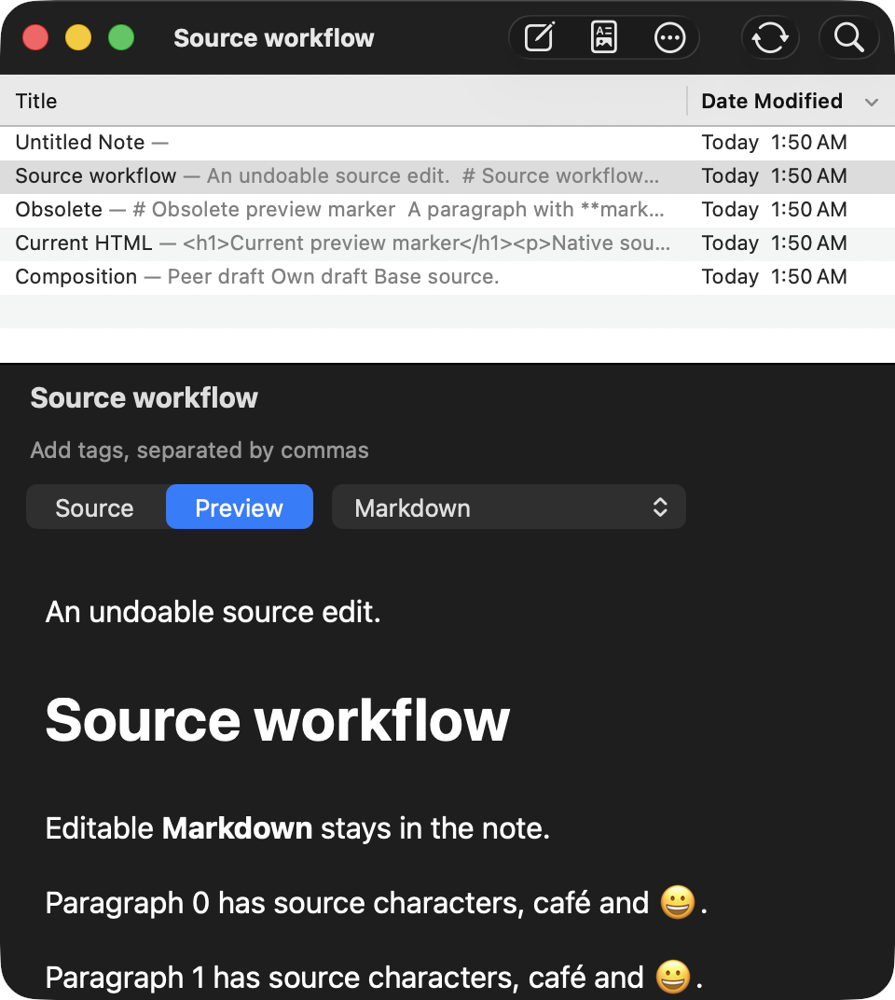

# nvALT — dangduc fork

nvALT is a macOS notes app with editable source and read-only Markdown, Textile, and HTML previews. This fork of [ttscoff/nv](https://github.com/ttscoff/nv) adds multiple windows and native macOS controls.

Every window keeps the notes list above the editor. All windows share one notes library.



## What changes in this fork

| Area | Upstream nvALT | This fork |
| --- | --- | --- |
| Windows | One main notes window. | Multiple windows share one library. Each window has its own search, selection, sort order, and scroll position. |
| Layout | Stacked or side-by-side panes. | The notes list always stays above the editor. Each window saves its divider height. |
| Controls | Custom window controls and a combined search/title field. | A native toolbar contains Search or Create. Separate fields edit the title and tags. |
| Search | The combined field also shows the selected title. | Fuzzy searches complete note sources. Literal title matches appear first, followed by native fuzzy order. Exact remains available. |
| Appearance | Legacy window controls and color schemes. | Native macOS controls and a notes list that follows system light and dark modes. The editor also supports custom colors. |

Saved side-by-side layouts restore as stacked panes. The fork retains note links, tags, source import/export, and custom editor fonts.

### Multiple windows

Each window can show a different note or search. Edits to the same note appear in all windows that show that note. Undo and Redo share the history for that note, including committed title and tag edits.

The app restores open windows and their saved views after a restart. A library change applies to all windows.

### Search

Choose **Fuzzy** or **Exact** from the search-field menu. Each window keeps its own mode.
Fuzzy matches characters in order, so `mtg` can match `meeting`. It searches titles, tags, and complete committed source text.
Double quotes require a contiguous phrase. Spaces and colons separate terms; punctuation remains literal.

Literal title matches appear first. The full fuzzy list follows in the order returned by `fzf-native`.
A note can appear in both groups. Either row opens the same note; selecting both affects that note once in bulk actions.
Column sorting changes the title group. The fuzzy group keeps its native order.

Search runs in the background. Return waits for a complete result before opening a note or creating from an unmatched query.
Exact retains the earlier substring search over titles, tags, and bodies.
Older saved windows and bookmarks without a search mode restore as Exact.


### Native controls and appearance

The toolbar contains New Note, Preview, Note Actions, and Search or Create. Standard toolbar customization controls which items appear.

The title and tags sit between the list and the body. Tags use completion from the library. The editor supports system colors and custom colors. The notes list follows system light and dark modes, with optional alternating rows.

The **View** menu can hide the notes list, title, tags, or Source/Preview controls. These visibility settings apply to all windows.
Hidden rows release space to the body. Showing the notes list restores each window's previous divider height.
The **Show Source/Show Preview** command and **Syntax Type** submenu remain available when the controls are hidden.

<details>
<summary>Earlier dark appearance</summary>


This earlier screenshot predates system colors for the notes list.

</details>

The multiple-window and native appearance screenshots show the earlier layout on macOS 13.7.8.
The Source/Preview screenshots show this redesign on macOS 26.5.2. All screenshots use sample notes.

## Use the app

| Action | Instruction |
| --- | --- |
| Open another window | Choose **Window > New Window**, or press **Command-Shift-N**. |
| Create a blank note | Press **Command-N**. Enter the title, or edit the source if the title is hidden. |
| Find a note | Type in **Search or Create**. Use **Command-J** or **Command-K** to move through the results. |
| Edit a search result | Select the note. Then press **Return**. |
| Create from a search | If no note matches, press **Return** or click **Create**. |
| Edit the title or tags | Edit the field above the body. Press **Return** to commit, or **Escape** to cancel. |
| Resize the list | Drag the divider between the list and the editor. |
| Use system editor colors | Select **Follow System Appearance** in the color menu. |
| Open a preview | Select **Preview** above the body, then choose Markdown, Textile, or HTML. |
| Return to editing | Select **Source** above the body. |
| Select source syntax | In Source, choose Plain Text, Markdown, Textile, HTML, or JSON. |
| Select syntax with hidden controls | Choose **View > Syntax Type**, then select the syntax. |
| Hide the list or header rows | Use the visibility commands after **View > Hide/Show Note Previews in Title**. |

## Automated builds

The [macOS build workflow](https://github.com/dangduc/nv/actions/workflows/macos.yml) runs for pull requests to `master`, pushes to `master`, and manual runs.
It uses an Intel macOS 15 runner with Xcode 16.4.

1. Open a successful workflow run.
2. Download `nvALT-macos-x86_64-<run number>-<attempt>.zip` from **Artifacts**.
3. Extract `nvALT.app` from the ZIP file.

Downloads require a GitHub login. App archives expire after 30 days.
These are unsigned Development builds without notarization. Apple Silicon Macs require Rosetta.

Successful `master` builds create a `build-<run number>` tag at the built commit.
A rerun keeps the same tag. Pull requests and manual runs on other branches do not create tags.
Build tags do not change the app version or create GitHub Releases.

CI checks tag logic, native search behavior, and the app build. It also checks executable permissions in the archive.
The desktop integration suites remain separate. [Tests/CI/README.md](Tests/CI/README.md) describes the CI checks and tag rules.

## Dependency changes

This fork uses `NSJSONSerialization`, `NSDataDetector`, and an inline `WKWebView` preview.
Automatic updates and the Check for Updates menu items are disabled.

HTML files, web archives, and web-page downloads cannot be imported.
Pasted URLs remain plain text. Browser paste uses a plain-text representation when available.
The `nvalt://make` action accepts `txt`; its `html` and `url` import parameters are disabled.
You can type or paste HTML source and select the HTML viewer. Rendered HTML export remains available.

## Build and run

The [official nvALT download](https://brettterpstra.com/projects/nvalt/) contains upstream nvALT, without these fork changes.

The build requires full Xcode. Command Line Tools alone are insufficient.
The bundled MultiMarkdown executable and OpenSSL archive require an Intel build. Apple Silicon Macs need Rosetta.

The command below passed on macOS 26.5.2 with Xcode 26.6 and the macOS 26.5 SDK. Other runtime versions need separate checks.

1. Clone this fork:

   ```sh
   git clone https://github.com/dangduc/nv.git
   cd nv
   ```

2. Build the Development app:

   ```sh
   xcodebuild -project Notation.xcodeproj -scheme 'Notation Develop' \
     -derivedDataPath build/DerivedData ARCHS=x86_64 \
     MACOSX_DEPLOYMENT_TARGET=10.13 CODE_SIGNING_ALLOWED=NO \
     GENERATE_PROFILING_CODE=NO OTHER_CFLAGS= WARNING_LDFLAGS= build
   ```

3. Quit any other nvALT build before the first run.
4. Run the app:

   ```sh
   open build/DerivedData/Build/Products/Development/nvALT.app
   ```

The build retains the upstream application identifier and can use existing nvALT settings and notes. The built-in updater is disabled. Updates to this fork require a new local build or CI artifact.

## Development checks

### Project layout

| Directory | Contents |
| --- | --- |
| `Sources/` | Application code, grouped by responsibility. Headers stay beside their implementations. |
| `Resources/` | Images, help, syntax queries, interfaces, and localized resources in `Localization/*.lproj/`. |
| `Config/` | Application plist, prefix header, and linker order files. |
| `ThirdParty/` | Bundled source dependencies, markup processors, and OpenSSL. |
| `Scripts/` | Development utilities. |
| `Tests/` | Cocoa integration suites, regression checks, CI checks, and review records. |
| `docs/` | Documentation assets and screenshots. |

`Notation.xcodeproj` stays at the repository root. Its navigator groups match the directories on disk.

### Run the suites

After a Development build, run these commands from an active desktop session:

```sh
python3 Tests/run-multiple-windows-tests.py
python3 Tests/run-regression-tests.py
```

The suites use temporary notes and a copy of the app. They cover shared edits, Undo/Redo, window restoration, search, metadata, preview ownership, and appearance.

[Tests/README.md](Tests/README.md) describes focused checks and full-screen checks. [The review record](Tests/NativeUIReview/VALIDATION.md) lists results and limits. External editor apps need separate manual checks.

## Source and preview

New notes start as editable Plain Text. The syntax menu enables Tree-sitter highlighting for Markdown, HTML, and JSON.
Textile source supports markup insertion commands with plain display.
Simplenote support is removed. Existing local notes remain available.
Syntax settings stay in the local library. They are independent of each window's preview format.

Each window can edit Source or show a read-only preview of the same note.
Switching modes retains the source, Undo, caret, and scroll position. Existing composition commits only in the editor being hidden.
Markdown preview uses MultiMarkdown. Preview and Save HTML use the same rendered result.



Preview offers selection, Copy, Find, and HTML export. Printing requires macOS 11 or later.

Plain-text paste and imports preserve source characters, whitespace, and line endings.
Text imports retain their original bytes, encoding, and byte-order mark where possible.
An edit that cannot use the original encoding offers UTF-8 conversion.

Rich-text notes, rich-text import/export, detached previews, sticky previews, sharing, and custom templates are no longer supported.
The viewer blocks active note scripts and remote resources. Passive local assets can load from the note's directory.
Native file storage and Quick Look previews are planned for a later milestone.

## Contribute and credits

[architecture.md](architecture.md) explains controller ownership, shared editing, storage, and window lifecycle.

[AGENTS.md](AGENTS.md) describes the source layout, coding conventions, and pull request requirements. Reports about this fork belong in [dangduc/nv issues](https://github.com/dangduc/nv/issues).

nvALT comes from Brett Terpstra and David Halter. It builds on Zachary Schneirov's [Notational Velocity](https://github.com/scrod/nv) and [DivineDominion's MultiMarkdown fork](https://github.com/DivineDominion/nv).

The repository includes the [GNU General Public License, version 3](COPYING.txt). Bundled components retain their own license notices.
