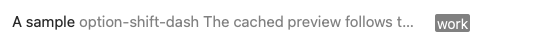
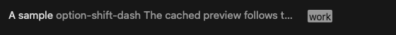

# Notes list appearance validation

Host: macOS 26.5.2 (25F84), Xcode 26.6 (17F113), Apple Silicon.

The Development Intel build passed with the command in `AGENTS.md`.
The build retains existing compiler and analyzer warnings.
The focused `Tests/Regression/native-list/run-native.py --negative-control` command passed 38 checks.
Its negative control detected missing tag words with the obsolete compositing operation.
The native UI integration harness compiled for arm64 and x86_64 without diagnostics.

The focused fixture draws the production preview formatter and extracted tag-image method with fixed font preferences.
It checks the same cached text and shared image cache through light, dark, and light appearances.
It checks ordinary and selected text, tag colors, and visible tag words.
Its screenshots show sample rendering, not a complete browser window.

Full desktop tests remain blocked by the host's existing Intel startup stall.
The earlier disposable Intel probes remain in an uninterruptible state before application startup.
They were still present during this change's validation.
No additional Intel application probes were launched.
The focused fixture does not establish full browser lifecycle, keyboard-focus, or live system-notification behavior.
