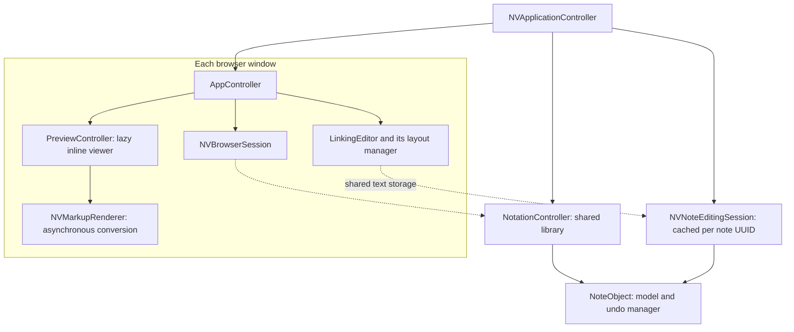

# Architecture

nvALT is a Cocoa application written mainly in Objective-C, with C utilities and manual memory management.
This fork supports multiple browser windows over **one shared notes library**.
Each window keeps the notes list above the editable source or a read-only viewer.

This document describes the current implementation. See [README.markdown](README.markdown) for features and build instructions.

## Runtime ownership

The application owns the library and coordinates windows. Browser sessions hold window-specific search state.
Editing sessions share live text between windows that display the same note.

Solid arrows show ownership or control. Dashed arrows show access to shared state.

| Component | Responsibility |
| --- | --- |
| [NVApplicationController](Sources/Application/NVApplicationController.m) | Owns the library, browser controllers, and editing-session cache. Routes application actions and library notifications. |
| [AppController](Sources/Browser/AppController.m) | Owns one browser window, its views, selection, presentation state, and lazy viewer controller. The initial instance also handles legacy application services. |
| [NVBrowserSession](Sources/Browser/NVBrowserSession.m) | Holds one window's query, matching notes, visible rows, sort order, and list-preview cache. |
| [NotationController](Sources/Storage/NotationController.m) | Owns notes, labels, storage, journal recovery, and sync services. |
| [NoteObject](Sources/Model/NoteObject.m) | Stores a note's UUID, title, body, tags, dates, file identity, sync metadata, and undo manager. |
| [NVNoteEditingSession](Sources/Editor/NVNoteEditingSession.m) | Owns shared `NSTextStorage`, committed snapshots, deferred external content, and optional source analysis. Coordinates body and metadata edits. |
| [GlobalPrefs](Sources/Preferences/GlobalPrefs.m) / [NotationPrefs](Sources/Preferences/NotationPrefs.m) | Manage application settings and library-specific settings, respectively. |

## Startup and command routing

[main.m](Sources/Application/main.m) enters `NSApplicationMain`.
The localized `MainMenu.xib` creates the initial `AppController`.
That controller installs `NVApplicationController` as the application delegate.
The coordinator delegates existing startup work to the initial controller, then configures menus, services, hotkeys, and window restoration.

Additional windows load a localized `BrowserWindow.xib` and attach to the existing library.
They do not open another database or start another set of sync services.
The initial controller remains retained after its window closes because it still owns application settings and status UI.

Window commands usually reach the active browser through the coordinator.
View actions use `NVControllerForView()` to find their owning browser.
During a forwarded library call, the coordinator records the originating browser.
Library reveal callbacks use that browser, falling back to the active browser outside the call.
Application settings and lifecycle commands still use the initial controller.

One compatibility detail matters when reading older code: `AppController`'s `notationController` variable now holds an `NVBrowserSession`.
Use `browserSession` for window state and `sharedNotationController` for the library.
The session forwards remaining library methods through `performLibraryInvocation:fromBrowser:`.

## Search and window state

Each browser session filters the shared notes into its own result set.
Search terms match titles, bodies, or tags without case sensitivity. Every term must match somewhere in the note.
The parser supports quoted phrases.

Incremental search can reuse previous matches when a query becomes more restrictive.
Library changes invalidate those candidates.
Reveal refreshes a stale browser list before it searches for the requested note.
If the query excludes that note, Reveal clears that browser's query without activating its window.
During a library refresh, the selected note can remain visible even when an edit makes it stop matching.
That retained row is excluded from the search candidate cache.

Selection, editor scroll, list scroll, divider height, and column layout belong to the browser.
Application settings can supply defaults or update shared display choices.
Do not move query state into the library or reuse another window's list-preview cache.

## Shared editing and Undo

The coordinator creates editing sessions on demand and caches them by note UUID.
Each editor attaches its own layout manager to the session's text storage.
Windows therefore share live text while keeping separate selections and display state.
`NoteObject` holds the committed model content. Disk writes occur later.

A body edit follows this path:

1. `LinkingEditor` changes the shared text storage.
2. `AppController` asks the editing session to commit the change.
3. The session registers Undo and writes the content to `NoteObject`.
4. The note schedules persistence and sends `NVNoteContentsDidChangeNotification`.
5. The session sends `NVNoteEditorDidChangeNotification`. The coordinator refreshes affected editors and browser lists.

The session's write guard prevents its own model notification from reloading the content recursively.
Committed snapshots compare source characters. Links, font preferences, and highlighting do not add source Undo entries.
The note's undo manager also records title and tag changes.
Body editors disable Cocoa's automatic Undo registration to avoid a second history.

Input-method composition requires special handling.
While any attached editor has marked text, the session defers body commits and holds incoming model snapshots.
After composition ends, it compares local and external changes against the committed snapshot.
Non-overlapping changed ranges can merge.
Overlapping changes preserve external content in a separate note with an `(external changes)` title suffix.
The original note keeps the local content.

External body snapshots discard stale body Undo entries while retaining metadata history.
Snapshot updates use a bounded text diff to preserve selections in other editors.
If the diff exceeds its work limit, the session applies one replacement range.

When switching notes, detach only that editor's layout manager and attach it to the new storage.
Do not use `replaceTextStorage:`: it moves all layout managers attached to the old storage.
Editing sessions remain cached until library replacement or application termination.

## Persistence and external changes

`NotationController` owns the write queue and journal lifecycle.
[NotationFileManager](Sources/Storage/NotationFileManager.m) handles file operations.
[NotationDirectoryManager](Sources/Storage/NotationDirectoryManager.m) handles directory monitoring and reconciliation.
Storage uses a single database or separate plain-text files, according to `NotationPrefs`.
Rich-text documents and HTML files are no longer supported storage or import formats.
Archived attributed records supply their characters; authored formatting and attachments have no preservation guarantee.
Unsupported legacy file-storage preferences select database storage without deleting those original files.

`NoteObject` marks changed content dirty and requests a write.
The library batches writes using a delay after the latest change and a separate timer during continued editing.
It writes note files when required and appends journal records through [WALController](Sources/Storage/WALController.m).
[FrozenNotation](Sources/Storage/FrozenNotation.m) serializes the library snapshot and its settings.
Imported text retains its original bytes, encoding, and byte-order mark inside the archived `NoteObject`.
These bytes therefore remain inside encrypted note data when database encryption is enabled.
Encoding identity uses the original 32-bit value, including after legacy archive recovery sign-extends that value.
Unchanged source export returns the original bytes. Edits retain the encoding when it can represent every character.
An unrepresentable edit offers explicit UTF-8 conversion instead of lossy replacement.
A pending conversion remains in the note archive and retries after reopening. The existing source file stays unchanged until conversion succeeds.
Conversion requests check the exact live note before scheduling, presentation, and acceptance.
Removing a note invalidates its request. Deletion Undo creates a new request, so an older sheet cannot authorize a later source write.
Text Encoding cannot reinterpret that older file while source conversion is pending.
Directory reconciliation compares disk source with the last read, written, or separately preserved file bytes.
Metadata-only events preserve the pending edit without creating a conflict note.
A different external body becomes an “external changes” note with its own source file and synchronized journal record before local conversion can replace it.
Each conflict copy archives its origin note UUID inside the note data.
After a failed write or synchronization, retries reuse a matching unchanged copy, including after archive recovery.
Distinct external bytes or an edited conflict copy require a separate copy. Retries still synchronize the preserved record before replacing the original source.
The pending write checks disk again without waiting for directory notifications.
These checks use the existing file and journal transactions; they do not lock out simultaneous writes by external applications.
Unmarked non-UTF-8 imports keep the legacy MacRoman fallback. BOMs, encoding attributes, and explicit hints take precedence.

`NotationPrefs` stores local syntax identifiers by note UUID within each library.
A syntax change saves library preferences without dirtying the note or entering Simplenote requests.
`flushAllNoteChanges` drains pending writes and stores that snapshot atomically.
A visible editor change does not mean the disk write has finished.

[NotationSyncServiceManager](Sources/Sync/NotationSyncServiceManager.m) integrates service changes into the library.
[SyncSessionController](Sources/Sync/SyncSessionController.m) manages service sessions, scheduled pushes, status, and pending-change waits.
File changes and sync updates reach editors through the note model and editing sessions.
Windows observe shared sync status rather than owning separate service connections.

## Browser UI and previews

[AppController_BrowserUI.m](Sources/Browser/AppController_BrowserUI.m) builds the native toolbar, title and tag fields, and `NSSplitViewController` layout.
The localized nibs supply reusable views and connections.
The split view uses `setVertical:NO`: its horizontal divider keeps the list above the body.
Automatic macOS window tabbing is disabled.

The notes list uses a white background and an explicit Aqua appearance in both light and dark modes.
The editor can follow system appearance or use configured colors.
[LinkingEditor](Sources/Editor/LinkingEditor.m) applies display colors and search highlights through each editor's layout manager.
An appearance change must not rewrite shared note content.

The search field holds a query independently of the selected note's title.
Title and tag controls commit through the editing session and retain the original target note during an edit.
New Note creates a blank note. Creation from search uses the query as the title.

Search commands restore the toolbar and complete window layout before they focus the field.
A search field with enough editing width receives focus directly.
A hidden or compressed field uses the native toolbar expansion.
This avoids a second, delayed focus change after the user moves to the note body.

The body header selects Source or Preview. New notes and windows start in Source with Plain Text syntax.
A restored window can return to its saved preview.
The source syntax menu controls highlighting and source insertion commands independently of the preview format menu.
Markdown, Textile, and HTML are the initial read-only viewers.

[AppController_Preview.m](Sources/Browser/AppController_Preview.m) hosts the controls and one lazy [PreviewController](Sources/Preview/PreviewController.m).
Source-only windows allocate no viewer or web view.
The editor retains its shared storage attachment while hidden, with editing commands disabled.
Switching to Preview unmarks only that window's source editor and asks the session to commit pending input.
A peer's composition can defer the shared commit. The viewer then uses the last committed model snapshot.
Mode and viewer changes preserve source, Undo, caret, and separate scroll positions when no edits are pending.
Transition captures read current DOM scroll positions before replacement navigation.
Callbacks retain their original note and viewer identity, with a bounded cached-state fallback if WebKit does not reply.
The provider and browser order canonical state updates per note and viewer. Older replies still complete but cannot replace newer restoration state.
A loading return joins the pending exact capture for that presentation without extending its deadline.
Each caller retains its own non-scroll state while sharing that read's offsets and deadline.
A return adopts the latest caller's cached Find state on entry; the later capture updates offsets without replacing a newer query.
Preview keeps the saved Source position instead of reading the hidden editor's clip origin.
Source restoration lays out through the saved viewport before applying that position.
Library replacement and restoration reject older state callbacks. Synchronous application termination can use the last cached viewer position.

[NVNoteContentSnapshot](Sources/Preview/NVNoteContentSnapshot.m) copies the library identity, note UUID, generation, title, source, syntax, and scoped asset root.
[NVMarkupRenderer](Sources/Preview/NVMarkupRenderer.m) converts Markdown or Textile asynchronously and sanitizes direct HTML.
It bounds helper time, output, and cancellation. Preview and HTML export consume the same immutable result.
The browser and provider reject obsolete results after note changes, viewer changes, or closure.

The viewer uses `WKWebView` with inert note content, a content security policy, network blocking, and scoped local assets.
It exposes no application script bridge. Explicit external links open through the system.
Selection, Copy, Find, and HTML export are supported. Printing uses the provider capability available on macOS 11 and later.
Detached preview windows, sticky previews, sharing, TaskPaper conversion, and custom script templates are removed.

[NVReadonlyNoteViewer](Sources/Preview/NVReadonlyNoteViewer.h) defines native view, snapshot, capability, cancellation, and restoration boundaries.
The snapshot interface reserves native data and file inputs. Managed native payload storage and Quick Look remain future work.

## Source analysis

[NVSourceHighlighter](Sources/Editor/NVSourceHighlighter.m) owns a serial parser worker for one editing session.
Analysis starts when a layout attaches and releases when the last layout detaches.
It receives immutable UTF-16 source snapshots and applies generation-checked captures through each layout manager's temporary attributes.
Syntax colors never enter note storage or Undo. Search highlights and native link display remain independent.
Character notifications invalidate capture revisions immediately. Removing stale attributes waits until TextKit finishes updating its layout caches.

The initial pinned Tree-sitter runtime supports Markdown block and inline syntax, HTML, and JSON.
Plain Text and Textile use plain source display. Language injections and structural editing are not implemented.
Incremental parsing reuses compatible trees. Queries cover the current tree within a work budget.
Display application has a separate limit of 4,096 capture writes across all attached layouts per revision.
Results above that limit use plain display. The operation count does not bound glyph layout or painting time.
Unsupported queries, large notes, time limits, and cancellation fall back to editable plain source.
[The dependency manifest](ThirdParty/TreeSitter/manifest.json) records revisions and hashes; bundled notices accompany the queries.

## Library replacement, closure, and restoration

Before replacing the library, the coordinator finishes browser edits and closes cached editing sessions.
It closes the old library's resources, attaches every browser to the new library, and starts its sync services.
`closeAllResources` stops file monitoring and sync, flushes pending changes, and removes the journal after a successful flush.

Closing a browser finishes edits, detaches its editor, and closes its preview.
Additional browsers also unregister their observers. The initial controller remains the bridge to application services.
The application can remain open without visible browsers, depending on the quit-on-close setting.
Termination saves window state, commits editing sessions, and uses the existing application shutdown and sync-wait paths.

[AppController_MultipleWindows.m](Sources/Browser/AppController_MultipleWindows.m) serializes browser state.
`NVApplicationController` stores it under the `NVBrowserWindows` defaults key and restores up to 20 windows.
Saved state includes the query, sort, selected note UUID, selection range, scroll positions, frame, columns, and divider height.
Versioned presentation state adds Source/Preview mode, viewer identifier, and separate source and viewer scroll positions.
Restoration checks selection bounds and converts old side-by-side layouts into a vertical stack.

## Working on the architecture

Application source files live in `Sources/`, grouped by responsibility.
Objective-C categories divide existing controllers across files such as `AppController_Importing.m` and `NotationDirectoryManager.m`.
Headers stay beside their implementations. Xcode navigator groups match the directories on disk.
`Resources/` contains application assets and localized interfaces. `Config/` contains build configuration files.
`ThirdParty/` contains bundled dependencies, including markup processors and OpenSSL. `Scripts/` contains development utilities.
Add new source files and resources to [Notation.xcodeproj](Notation.xcodeproj).

Preserve manual `retain`/`release` ownership.
When changing window lifetime, check observer removal, delayed callbacks, nib ownership, and shared text attachments.
Keep library I/O and sync startup outside browser sessions.
Add regression checks for changes to ownership, command routing, and restoration.

[Tests/README.md](Tests/README.md) explains the Cocoa integration suites and focused regression checks.
They use a copied app and temporary notes in an active desktop session.
Live sync services and external editor applications require separate manual checks.

The [macOS workflow](.github/workflows/macos.yml) builds and packages an unsigned Intel app, then tags successful builds on `master`.
It does not run the desktop integration suites.
See [Tests/CI/README.md](Tests/CI/README.md) for artifact validation and tagging rules, and [AGENTS.md](AGENTS.md) for contributor conventions.
