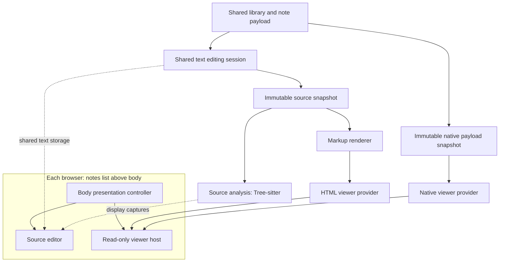

# Editable source and read-only viewers

Status: steps 1–5 implemented and validated.
See the [validation record](../Tests/SourceViewerReview/VALIDATION.md) for results and runtime limits.
Managed native payloads and Quick Look remain the next milestone.
Product decisions were settled on September 8, 2026.
The historical application findings below refer to commit `92cb054128fa972df8e378ca76cbecbf1863f457`.

## Accepted direction

Make **Source** the default body mode for text notes.
Keep the existing native editor and shared editing sessions.
Offer Markdown, Textile, and HTML as read-only viewers in the same body area.
The notes list stays above that area.

Add Tree-sitter source highlighting for Markdown, HTML, and JSON first.
Keep its parse trees separate from preview conversion, persistence, and Undo.

Define viewers around content snapshots, with text, data, or files as possible inputs.
This permits native document viewers later without forcing every format through HTML.
Native files also need preserved payloads in storage before the application can promise native previews.

## Accepted scope

| Decision | Scope |
| --- | --- |
| Default mode and syntax | Editable Source, with Plain Text syntax for new notes. |
| Read-only text viewers | Markdown, Textile, and HTML in the browser body. |
| Source fidelity | Preserve local characters and line endings. Retain imported encoding, BOM, and original bytes where possible. |
| Existing rich-text notes | Drop support. No legacy viewer, formatting migration, or rich-text round-trip guarantee. |
| Syntax metadata | Local persistence by library identity and note UUID. |
| Simplenote | Keep existing support temporarily. Removal is future work. |
| Old preview features | Remove detached preview windows, sticky previews, sharing, and script-dependent templates. |
| Initial highlighting | Tree-sitter for Markdown, HTML, and JSON. Structural features and injected languages come later. |
| Native formats | Later milestone with managed library copies and Quick Look. External file references are outside the initial scope. |

The first milestone delivers source editing and interchangeable text viewers.
Its interfaces accept future native payloads without requiring their storage implementation now.

## Interaction

The body header has a Source/Preview control and a viewer menu.
Source is selected for new notes and windows without saved presentation state.
An explicitly restored window can restore its viewer selection.
The viewer menu initially offers Markdown, Textile, and HTML for text notes.

Each browser keeps its own mode, viewer selection, source selection, and scroll positions.
Two windows can show the same note as editable source and a read-only preview.
Presentation changes introduce no note mutations beyond completion of pre-existing edits.
With no pending edits, switching modes changes no characters, metadata, storage format, or Undo entries.

Read-only viewers offer selection, Copy, Find, printing, and export where the provider supports those actions.
Body edit commands are unavailable until the user returns to Source.
Title and tag fields remain separate, editable metadata controls.
Source mode restores the caret and scroll position that preceded the switch.

The mode switch unmarks only the source view that it hides, then asks the shared session to commit.
It must not use `finishEditingForHistoryChange`, which unmarks every attached editor.
Finishing pending source input can legitimately update Undo, dates, persistence, and sync.
The switch never commits another window's marked text.
A viewer can retain the last committed snapshot until composition in another window ends.
Returning to Source restores the live shared storage.

The redesign removes the generated HTML tab and detached preview window.
Rendered HTML remains available through export where the provider supports it.
Sticky previews and preview sharing are removed with their commands, preferences, resources, and client code.

## Investigation baseline

| Area | Finding | Consequence |
| --- | --- | --- |
| Main editor | [AppController_Preview.m:12](https://github.com/fastducduc/nv/blob/92cb054128fa972df8e378ca76cbecbf1863f457/Sources/Browser/AppController_Preview.m#L12) returns the live editor string. | Most text notes already have editable source. |
| Preview source tab | [PreviewController.m:348](https://github.com/fastducduc/nv/blob/92cb054128fa972df8e378ca76cbecbf1863f457/Sources/Preview/PreviewController.m#L348) assigns converted HTML to a read-only text view. | “Source” currently names two different representations. |
| Shared editing | [NVNoteEditingSession.m:126](https://github.com/fastducduc/nv/blob/92cb054128fa972df8e378ca76cbecbf1863f457/Sources/Editor/NVNoteEditingSession.m#L126) owns shared text storage, snapshots, composition handling, and Undo. | Preserve this machinery. |
| Model | [NoteObject.h:39](https://github.com/fastducduc/nv/blob/92cb054128fa972df8e378ca76cbecbf1863f457/Sources/Model/NoteObject.h#L39) stores attributed text. Archives preserve that representation. | Replacing the model with a string is a separate compatibility change. |
| Native body layout | [AppController_BrowserUI.m:36](https://github.com/fastducduc/nv/blob/92cb054128fa972df8e378ca76cbecbf1863f457/Sources/Browser/AppController_BrowserUI.m#L36) creates the list and editor containers. | The lower container provides a suitable viewer host. |
| Mode state | [AppController.m:2406](https://github.com/fastducduc/nv/blob/92cb054128fa972df8e378ca76cbecbf1863f457/Sources/Browser/AppController.m#L2406) persists preview mode through one global preference. | New presentation state belongs to each browser. |
| Editing coupling | [AppController_Importing.m:247](https://github.com/fastducduc/nv/blob/92cb054128fa972df8e378ca76cbecbf1863f457/Sources/Browser/AppController_Importing.m#L247) chooses image insertion syntax from preview mode. | Source syntax must be independent of the chosen viewer. |
| Rendering | [PreviewController.m:315](https://github.com/fastducduc/nv/blob/92cb054128fa972df8e378ca76cbecbf1863f457/Sources/Preview/PreviewController.m#L315) reads the browser and synchronously converts text. | Explicit immutable requests permit background conversion and stale-result rejection. |
| Export | [NSString_MultiMarkdown.m:123](https://github.com/fastducduc/nv/blob/92cb054128fa972df8e378ca76cbecbf1863f457/Sources/Preview/NSString_MultiMarkdown.m#L123) obtains titles through the application delegate. | Export needs the request's title, independent of the active window. |
| Restoration | [AppController_MultipleWindows.m:96](https://github.com/fastducduc/nv/blob/92cb054128fa972df8e378ca76cbecbf1863f457/Sources/Browser/AppController_MultipleWindows.m#L96) stores editor state but no viewer state. | Extend browser restoration with versioned presentation state. |

Preview currently supports MultiMarkdown and Textile.
The legacy Markdown choice maps to MultiMarkdown for display, but an export path still uses the older Markdown processor.
There is no direct HTML viewer.

[NSString_MultiMarkdown.m:85](https://github.com/fastducduc/nv/blob/92cb054128fa972df8e378ca76cbecbf1863f457/Sources/Preview/NSString_MultiMarkdown.m#L85) also detects `Archive:` or `@taskpaper` and runs Ruby conversion before Markdown.
That behavior needs a compatibility policy when TaskPaper becomes an explicit source format.
The current converters can remain initially, behind adapters with error results, cancellation, and process time limits.
Preview and export then consume the same conversion result.

## Separate four concepts

| Concept | Example | Owner |
| --- | --- | --- |
| Content payload | Text, a PDF's original bytes, or an RTFD package | Shared library |
| Source syntax | Plain text, MultiMarkdown, Textile, HTML, or JSON | Note descriptor |
| Viewer selection | Markdown interpretation or native preview | Browser presentation state |
| Storage serialization | Existing database, text file, or future payload storage | Library storage policy |

A text note can use HTML syntax highlighting while a browser temporarily views it as plain text.
Choosing a viewer must not change the syntax used by insertion commands.
The existing library-wide `notesStorageFormat` and note `currentFormatID` cannot represent these distinctions.

New text notes start with Plain Text syntax.
The user can explicitly select Markdown, Textile, HTML, or JSON syntax.
An imported text file can supply a syntax hint from its type and extension.
Ambiguous text remains plain text until the user chooses a syntax.
New windows use Markdown as their initial viewer. Explicit saved presentation state overrides that choice.
The old global preview preference does not assign syntax to notes.

Syntax metadata stays local, keyed by library identity and note UUID.
It survives reopen, note renames, and browser changes for both database and file storage.
Local library backup includes this metadata. Standalone text export need not include it.
Viewer choice stays in browser state and does not alter that metadata.
Simplenote receives neither syntax metadata nor viewer state.

## Boundaries

The names below describe responsibilities, not a requirement for one class per row.

The body presentation controller owns the source view and the active viewer controller.
It handles mode changes, responder routing, loading states, and restoration.
It does not own library I/O or a second mutable copy of the note.

A snapshot contains library identity, note UUID, content generation, title, content descriptor, and text or native payload access.
A new request supersedes its predecessor when source, title, syntax, viewer, or asset context changes.
Native payload access can use a retained snapshot file lease instead of copying large files into memory.
The snapshot has no mutation methods.

A provider declares supported types, a stable identifier, and capabilities such as selection, Find, printing, and export.
It creates a native view controller and accepts snapshots asynchronously.
It reports preparation errors and restorable display state, plus loading, failure, and cancellation where its underlying API supports them.
Quick Look does not expose a general public rendering-completion or failure callback.
Its adapter can report snapshot preparation failures without promising complete insight into native rendering.
An HTML renderer is one provider family rather than the base interface for all viewers.

Each request has an identity that includes the selected note, content generation, metadata generation, provider, and viewer settings.
The host discards results from obsolete requests.
Closing a window or replacing the library cancels work and releases its views, observers, tasks, and snapshot leases.
Manual retain/release ownership remains explicit.

## Source fidelity and migration

“Editable source” initially means local preservation of the note's Unicode characters, including line endings.
Original file bytes require a stronger contract that also preserves encoding, BOM, and resources.
These contracts need distinct acceptance tests.
New text files use UTF-8.
Text import retains original bytes and encoding information where possible, without normalization during import.
Later edits preserve the recorded encoding when it can represent the source.
An unrepresentable edit needs an explicit encoding-conversion path rather than character replacement.

The existing attributed wrapper can remain temporarily as an implementation detail for Cocoa text storage and archive decoding.
New source editing uses plain-text paste and source insertion commands.
Syntax colors and other derived display attributes never enter the model or Undo snapshots.
Smart quotes, smart dashes, and automatic replacement start disabled for new source settings.
The new source settings use separate preference keys; legacy rich-editor substitution defaults are not migrated.
Markup conveniences remain explicit, syntax-dependent choices.

[LinkingEditor.m:566](https://github.com/fastducduc/nv/blob/92cb054128fa972df8e378ca76cbecbf1863f457/Sources/Editor/LinkingEditor.m#L566) currently switches between Markdown markers and rich-text formatting.
[LinkingEditor.m:433](https://github.com/fastducduc/nv/blob/92cb054128fa972df8e378ca76cbecbf1863f457/Sources/Editor/LinkingEditor.m#L433) also accepts rich-text paste.
The redesign removes rich-text paste, rich-text formatting commands, and rich-text note import and write paths.
Markup commands insert source characters according to the selected syntax.

Existing rich-text notes are outside the supported content contract.
Existing attributed database records can supply their characters through archive decoding.
Authored formatting and attachments have no preservation guarantee in the source representation.
There is no legacy viewer, conversion wizard, or rich-text migration project.
Dropping these features does not require a batch rewrite or deletion of existing libraries.

[NoteObject.m:1534](https://github.com/fastducduc/nv/blob/92cb054128fa972df8e378ca76cbecbf1863f457/Sources/Model/NoteObject.m#L1534) parses HTML and RTF into attributed text.
[NoteObject.m:1240](https://github.com/fastducduc/nv/blob/92cb054128fa972df8e378ca76cbecbf1863f457/Sources/Model/NoteObject.m#L1240) generates new HTML or RTF during writes.
Original HTML markup is therefore unavailable from a previously normalized database note.
Generated HTML cannot serve as recovered original source.

[AlienNoteImporter.m:302](https://github.com/fastducduc/nv/blob/92cb054128fa972df8e378ca76cbecbf1863f457/Sources/ImportExport/AlienNoteImporter.m#L302) converts PDF, Word, and RTFD inputs into text.
It also removes attachments and leading whitespace.
Even plain-text import uses the leading-whitespace removal path.
A source-preserving text importer therefore belongs in the source editing milestone.
Native support requires a new preservation path that keeps original files and packages.
Search extraction remains derived data and never replaces a native payload.

The recently disabled HTML import remains disabled during the viewer work.
An HTML viewer can display HTML characters already present in a text note.
A later HTML source import decodes text without HTML extraction or style conversion.

[SimplenoteEntryCollector.m:271](https://github.com/fastducduc/nv/blob/92cb054128fa972df8e378ca76cbecbf1863f457/Sources/Sync/SimplenoteEntryCollector.m#L271) replaces tabs with spaces in outgoing content and combines title and body.
The local source fidelity contract does not promise exact round trips through this legacy sync path.
Repairing those transformations is not a prerequisite for the redesign.
Existing Simplenote support remains temporarily, with no new syntax metadata or native payload features.
Its eventual removal is a separate change.

## Viewer implementations

| Provider | Suggested implementation | Scope |
| --- | --- | --- |
| Markdown | Existing MultiMarkdown adapter, then `WKWebView` | Preserve current dialect while refactoring. |
| Textile | Existing Textile adapter, then `WKWebView` | Independent of syntax highlighting availability. |
| HTML | Inert HTML in `WKWebView` | Interpret source directly, without converting the stored note. |
| Native file | Embedded `QLPreviewView` | Later fallback for formats supported by Quick Look. |
| Specialized native file | For example, `PDFView` | Add only when the generic viewer lacks required controls. |

`WKWebView` and `QLPreviewView` fit the current macOS 10.13 target.
The modern `UTType` class requires macOS 11.
A string type identifier and a compatibility helper avoid raising the deployment target for this design.
Availability was inspected in the installed SDK. See Apple's [UTType compatibility example](https://developer.apple.com/documentation/appkit/supporting-collection-view-drag-and-drop-through-file-promises).

`WKWebView` supplies browser behavior, so read-only presentation needs deliberate controls.
The proposed HTML viewer disables document scripts, form editing, and content editing.
It restricts navigation, handles deliberate external links, and blocks remote subresources by default.
Local resources come from a controlled asset scope.
A nonpersistent data store avoids persistent website data but does not block network access.
These controls use [WKWebView](https://developer.apple.com/documentation/webkit/wkwebview) and [content rule lists](https://developer.apple.com/documentation/webkit/wkcontentruleliststore).

The viewer keeps static styling, scoped local images, and scroll restoration.
Script-dependent template support and the `Cocoa.log` application bridge are removed.
Static template or CSS reuse does not require compatibility with the old script APIs.

Quick Look requires a file URL and loads preview content asynchronously.
The proposal gives each revision an immutable snapshot file with the appropriate extension and resources.
The viewer retains that file until it releases the preview item.
Terminal disposal explicitly closes the `QLPreviewView` before it releases the view and snapshot.
Ordinary mode switches can retain the provider or recreate it after disposal.
This avoids previewing stale disk content or overwriting files during asynchronous reads.
See [QLPreviewItem](https://developer.apple.com/documentation/quicklookui/qlpreviewitem) and [QLPreviewView](https://developer.apple.com/documentation/quicklookui/qlpreviewview).

Quick Look supports many common formats, but support depends on the OS and available providers.
Its public macOS view API does not reliably announce unsupported content.
The host always offers Source for text and file information for binary content, even during the system's fallback display.
An explicit external-open action remains available for native files.
Binary content has no general editable text source. See [Quick Look UI](https://developer.apple.com/documentation/quicklookui).

Native payload storage is a separate milestone with backup, deletion, external-change, and sync rules.
It imports managed copies into the shared library rather than retaining references to external originals.
Preview snapshot leases refer to these managed payloads, not linked originals.
Large payloads cannot use the current whole-note attributed Undo snapshots and journal serialization unchanged.
Packages also need resource preservation and snapshot cleanup after crashes.
Title or tag edits must never regenerate native payload bytes.

## Tree-sitter assessment

Tree-sitter supplies source analysis for the initial Markdown, HTML, and JSON highlighting scope.
Its incremental parser has a C11 runtime and tolerates incomplete syntax.
The application can compile pinned generated grammars with Xcode.
End users do not need Node.js, Rust, or the Tree-sitter CLI for this approach.
See the [Tree-sitter introduction](https://tree-sitter.github.io/) and [C API guide](https://tree-sitter.github.io/tree-sitter/using-parsers/).

### Useful features

| Feature | Recommendation |
| --- | --- |
| Syntax highlighting | First feature: headings, delimiters, strings, tags, and code spans. |
| Heading outline and section navigation | Reuse syntax nodes after highlighting works. |
| Expand selection | Select a syntax node, then its parent. |
| Context-aware commands | Avoid markup insertion inside code spans and fenced blocks. |
| Fenced code highlighting | Add a small, explicit set of injected language grammars later. |
| Folding | Later UI work. Parsing alone does not supply folding behavior in `NSTextView`. |
| Diagnostics and completion | Syntax context is useful, but semantic validation and language services require separate components. |

Tree-sitter does not replace MultiMarkdown or Textile rendering.
It also does not format or rewrite source unless the application explicitly implements such a command.

The maintained [Markdown grammar](https://github.com/tree-sitter-grammars/tree-sitter-markdown) targets CommonMark with extensions and documents known inaccuracies.
It recommends highlighting use rather than correctness-sensitive conversion.
Its block and inline grammars require two parsing stages with included ranges.
MultiMarkdown-specific syntax therefore needs fixtures, and highlighting can differ from rendered output.

The initial grammar set includes the upstream [HTML grammar](https://github.com/tree-sitter/tree-sitter-html) and [JSON grammar](https://github.com/tree-sitter/tree-sitter-json).
This investigation did not establish a maintained Textile grammar in the upstream [parser list](https://github.com/tree-sitter/tree-sitter/wiki/List-of-parsers).
Textile remains editable and viewable with plain source display until a grammar or limited highlighter passes evaluation.
A new Textile grammar is a separate maintenance commitment.

### Native integration

A source analysis object belongs to the shared editing session, with lazy creation and a bounded cache.
Unobserved notes can release their parser state even while the application retains their editing sessions.
It observes character edits, including Undo, external snapshots, and composition changes.
Each edit advances a source generation, even before a model commit.
Attribute-only edits do not trigger parsing.

The analysis object copies source on the main thread and owns parser state on a serial worker queue.
It never reads mutable `NSTextStorage` from that queue.
Before incremental parsing, it applies the exact character edits to the previous tree.
If the edit sequence is unavailable, it performs a fresh parse.
Tree-sitter documents this sequence through [TSInputEdit and incremental parsing](https://tree-sitter.github.io/tree-sitter/using-parsers/3-advanced-parsing.html).

Use an explicit UTF-16LE snapshot to align parser offsets with Cocoa's UTF-16 ranges.
Tree-sitter byte offsets then equal Cocoa code-unit offsets multiplied by two.
Point columns still count bytes, and line tracking follows line-feed characters.
Emoji, combining marks, CRLF, and replacement ranges need dedicated tests.
See [Tree-sitter input and positions](https://tree-sitter.github.io/tree-sitter/using-parsers/2-basic-parsing.html).

Queries produce semantic capture names, which each editor maps to its own colors.
Highlight captures are derived display data, not note attributes.
Tree-sitter describes highlights, local scopes, and language injections in its [highlighting guide](https://tree-sitter.github.io/tree-sitter/3-syntax-highlighting.html).

The C API does not execute query predicates or directives itself.
An Objective-C adapter must implement the supported subset or use a higher-level highlighting library.
The initial adapter can accept a documented, tested query subset for a few pinned grammars.
Unsupported predicates must cause an explicit fallback rather than silently incorrect highlighting.
The upstream Rust highlighter offers more behavior but adds a build toolchain and integration boundary.
See [query predicates and directives](https://tree-sitter.github.io/tree-sitter/using-parsers/queries/3-predicates-and-directives.html).

Apply captures through each editor's layout manager, with an explicit display precedence policy.
[LinkingEditor.m:398](https://github.com/fastducduc/nv/blob/92cb054128fa972df8e378ca76cbecbf1863f457/Sources/Editor/LinkingEditor.m#L398) currently overrides temporary foreground colors with the editor or link color.
Adding temporary syntax colors alone therefore does not work.
That delegate needs to compose base colors, syntax colors, links, search highlights, selection, and marked-text display.
Source printing also needs an explicit choice between source colors and plain text.

Results carry the source generation and syntax identifier.
The main thread discards stale results before it updates a layout manager.
The first implementation can query the full current tree with a work budget.
Later optimization must include edited text and affected syntax scopes, not only structural tree changes.
Equal-shaped edits can still change text-dependent captures.

Large notes, parse cancellation, query limits, or unsupported syntax fall back to plain source display.
The editor remains responsive and editable in that state.
No automatic code execution accompanies syntax detection or highlighting.

### Dependency cost

Vendor only the runtime, selected generated parsers, required scanners, queries, and license notices.
Pin their revisions and check grammar ABI compatibility.
The parser generator remains a development tool.
An all-language grammar bundle conflicts with the earlier dependency reduction goal.

### Feasibility spike results

An isolated native harness compiled the runtime plus JSON, HTML, and Markdown block/inline parsers without warnings.
It used Xcode 26.6, SDK 26.5, `-arch x86_64`, `-mmacosx-version-min=10.13`, and `-O2`.
The executable ran under Rosetta on macOS 26.5.2.
All 172 smoke assertions passed.

The checks cover UTF-16 emoji ranges, JSON incremental/fresh tree equivalence, incomplete JSON, HTML captures, and Markdown block/inline captures.
They also reproduce both integration traps described above: unevaluated C query predicates and equal-shaped edits with no structural changed ranges.

| Component | Pinned development snapshot | Selected source and query bytes |
| --- | --- | ---: |
| Runtime | [`072f68c`](https://github.com/tree-sitter/tree-sitter/tree/072f68c829696687fb01cbc8764e655b3ee942ba) | 891,231 |
| JSON | [`254c42a`](https://github.com/tree-sitter/tree-sitter-json/tree/254c42a6476413b776221e03982ac8ae159eeb72) | 62,697 |
| HTML | [`73a3947`](https://github.com/tree-sitter/tree-sitter-html/tree/73a3947324f6efddf9e17c0ea58d454843590cc0) | 119,871 |
| Markdown block and inline | [`a0a00f8`](https://github.com/tree-sitter-grammars/tree-sitter-markdown/tree/a0a00f817d02412bd92c54d316f164d827b57b5c) | 4,838,844 |

The selected directories total 5.64 MiB, dominated by Markdown's generated parsers.
The standalone executable, including its Foundation harness, totals 974,704 bytes (0.93 MiB).
This is not a measured application-size increase or a release-selection recommendation.
The runtime accepts grammar ABI 13–15. JSON and HTML use ABI 14, and Markdown uses ABI 15.
All four repositories use MIT licenses. The runtime also includes Unicode license notices that require preservation.

The ignored `build/source-viewer-spike/` directory contains `probe.m`, `build.py`, `build.log`, `run.log`, and `manifest.json`.
The manifest records exact revisions, file sizes, compiler settings, and exclusions.
That spike left the application target unchanged. The later implementation vendors the selected native components in `ThirdParty/TreeSitter/`.

The spike did not cover an actual macOS 10.13 runtime, AppKit integration, large-note latency, memory limits, or cancellation.
Incremental Markdown inline reuse and fenced-language injection also remain untested.
The next prototype needs measured typing latency and memory results on typical, large, and malformed notes.
Its corpus also needs MultiMarkdown extensions, code fences, TaskPaper markers, and unsupported Textile source.
The result supports a native integration prototype, not an immediate production rollout.

## Suggested delivery sequence

| Step | Deliverable | Main acceptance condition |
| --- | --- | --- |
| 1 | Snapshot requests and renderer adapters | Preview and export use the correct note and matching conversion output. |
| 2 | Inline Source/Preview host with browser-local state | Mode changes preserve source, Undo, composition, selection, and peer window state. Detached preview and sharing features are removed. |
| 3 | Source editing, text import, local syntax metadata, and rich-text removal | Plain source commands and imports preserve characters. Rich-text editing, import, and storage paths are removed. |
| 4 | Tree-sitter highlighting for Markdown, HTML, and JSON | Colors never enter persistence or Undo. Unicode and stale-result checks pass. |
| 5 | Modern HTML viewer and direct HTML interpretation | Read-only behavior, static styles, local assets, and failure states work without application script bridges. |
| 6 | Managed native payload storage and Quick Look provider | Original files survive storage, reopen, backup, and preview unchanged. |

Steps 1–5 form the first user-facing source and text viewer milestone.
Renderer extraction and the Tree-sitter prototype can proceed independently.
Each implementation step needs a Development build and the affected desktop suites.
The investigation alone does not justify a claim of production readiness.

## Acceptance evidence for implementation

- Without pending edits, Source → viewer → Source preserves source characters, UUID, dates, Undo, caret, and scroll.
- Without pending edits, switching viewers does not dirty the note or schedule sync. Viewer selection never changes insertion syntax.
- With pending composition, switching modes commits only existing local edits or defers the shared commit while another window composes.
- Two browsers display different modes for one note and refresh from the correct content generation.
- Composition, Undo, Redo, external changes, close, reopen, and library replacement retain their existing ownership behavior.
- Import and storage fixtures cover leading spaces, tabs, trailing newlines, Unicode, encodings, BOM, and line endings.
- Local syntax metadata survives reopen and rename without entering Simplenote requests.
- Existing sync fixtures retain their current contract without live network requests.
- Parser fixtures cover Markdown, HTML, JSON, malformed source, surrogate pairs, dialect differences, and equal-shaped edits.
- Highlighting leaves stored source, Undo, and source export unchanged.
- Rich-text editing, import, and storage commands are absent. Plain-text paste preserves source characters.
- Detached preview, sticky preview, sharing commands, and application script bridges are absent.
- Viewer fixtures cover slow results, cancellation, invalid output, failed helpers, unsupported formats, assets, and teardown.
- The later native-file milestone must preserve bytes and package resources, with extracted search text kept separate.

Existing suites include editing, selections, snapshot-diff, native-rendering, restoration, native-dependencies, and preview-lifetime.
The updated preview-lifetime tests count lazy viewer and `WKWebView` lifetimes.
They cover Source-only windows and repeated rendered windows without retaining the removed nib or script-bridge assumptions.
GitHub CI currently builds the app but does not run these desktop suites.
