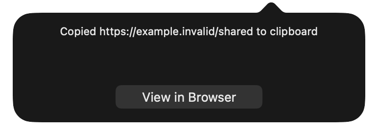

# Third-party asset audit

## Cleanup implemented

The requested cleanup removes 5,094,107 bytes (4.86 MiB), or 36.6% of the tracked `ThirdParty/` files.
The remaining assets occupy 8,824,755 bytes (8.42 MiB).

- Removed RBSplitView, hashcash, Readability and its unused executables, and `libssl.a`.
- Replaced the JSON library with `NSJSONSerialization` and AutoHyperlinks with `NSDataDetector`.
- Replaced MAAttachedWindow with native sharing popovers.
- Removed Sparkle, its configuration, public key, and updater menu items.
- Disabled HTML and web-page import. Removed the download controller and import preferences.

Existing HTML notes remain readable. Markup preview, HTML export, external editing, and encryption support remain available.

Validation used macOS 26.5.2 and Xcode 26.6. The Development build and archive checks passed.
The native dependency suite passed 55 checks. The multiple-window suite passed 48 checks, including relaunch. All 11 CI unit tests passed.
The regression run still fails two previously reproduced UI checks: metadata Undo focus and restoring the Search toolbar item.
One editing composition check failed during the aggregate run. Both the baseline app and the changed app passed its standalone rerun.
The other regression groups passed, including rendered preview teardown and native link rendering.
Live Simplenote sync and the sharing service were not contacted.

## Historical inventory

The following findings describe the source before cleanup. File links refer to that snapshot.

Audit date: September 7, 2026. Source commit: `8d514c7`, the layout submitted in merged PR #1.

`ThirdParty/` contains 13,918,862 bytes (13.27 MiB) across 14 component families, excluding symlink contents. Four removal candidates account for 3,623,330 bytes (3.46 MiB), or 26% of that total. A disposable Development build succeeds without them. They reduce the checked-out source tree, not the installed app: none contributes runtime content to the current build.

The next useful reductions require changes to active features. JSON and URL detection have native replacement candidates. Sparkle serves the upstream updater, and MAAttachedWindow serves the preview sharing feature. OpenSSL, active crypto helpers, and markup processors require compatibility work before removal.

The original audit left application files unchanged. Its removal experiment lives under the ignored `build/ThirdPartyAudit/` directory.

The inventory uses tracked file sizes. Line counts include comments, blank lines, and headers. They measure maintenance surface, not cyclomatic complexity. Binary size does not measure the amount of code linked into the app. Removal effort is low for disconnected files, medium for contained feature changes, and high for persistent-data or parser compatibility.

| Component | Footprint | Purpose and current use | Removal assessment |
| --- | --- | --- | --- |
| `Crypto/` | 31.5 KiB / 1,163 lines | PBKDF2 and SHA-1 support current keys. Broken MD5 and IDEA support encrypted `.blor` imports. All four implementations compile. | **High compatibility cost.** Split current encryption from legacy import support before replacement. |
| `Frameworks/AutoHyperlinks.framework` | 278.2 KiB / binary and headers | Version 0.8. Detects URLs in edited note text through one integration method. Linked and embedded. | **Medium.** Replace the scanner, with URL and note-link fixtures. |
| `Frameworks/Sparkle.framework` | 885.9 KiB / binary and headers | Version 1.5 Beta 6, build 313. Provides automatic and manual updates from upstream feeds. Linked and embedded. | **Medium.** A removal candidate if this fork uses CI or manual distribution. Requires a distribution decision and UI cleanup. |
| `JSON/` | 23.9 KiB / 729 lines | Five Objective-C implementations parse and generate Simplenote JSON. Two application files call them. | **Low–medium.** Replace with Foundation JSON serialization and response fixtures. |
| `MAAttachedWindow/` | 36.7 KiB / 1,135 lines | Custom window positioning and drawing for preview sharing confirmation and result bubbles. Two allocation sites in `PreviewController`. | **Medium.** Replace those bubbles with native UI, or remove them with the sharing feature. |
| `Markdown_1.0.1/` | 47.1 KiB / 1,450 code lines | Perl Markdown 1.0.1. Bundled and still called by Save HTML in Markdown mode. Normal Markdown preview already uses MultiMarkdown. | **Medium.** Consolidate export behavior first. This directory is not yet unused. |
| `MultiMarkdown/` | 586.2 KiB / executable only | MultiMarkdown 4.7.1. Handles the default preview, Markdown preview, HTML export, and sharing conversion. | **High.** Keep until a reproducible replacement preserves supported markup output. |
| `ODBEditor/` | 19.8 KiB / 513 code lines | External-editor protocol, Apple events, temporary files, Save As, and modified/closed callbacks. Both implementations compile. | **Medium–high.** Keep while external editing is supported. A simple file-open call is not equivalent. |
| `OpenSSL/lib/libssl.a` | 1.09 MiB | Listed in the link phase, but the Development link map contains no objects from this archive. No application `SSL_*` calls were found. | **Low. Remove.** The trial build omits the archive and its project references. |
| `OpenSSL/lib/libcrypto.a` and `OpenSSL/include/` | 7.62 MiB / binary plus 75 headers | OpenSSL 1.0.2d. Current AES-CBC, MD5 digests, and filesystem UUID generation use it. The link map contains 339 archive objects. | **High compatibility cost.** Replace active operations before removing the library and headers. |
| `PTHotKeys/` | 20.3 KiB / 963 lines | Registers the global app-activation shortcut and supplies its preference recorder. Five implementations and a key-name plist are active. | **Medium, low benefit.** Keep unless the shortcut feature changes. |
| `RBSplitView/` | 120.7 KiB / 3,171 lines | Previous split-view implementation. No application imports, compiled objects, or runtime nib class references remain. | **Low. Remove.** Native split-view code owns the current layout. Clean stale metadata separately. |
| `Textile_2.12/` | 107.7 KiB / 3,587 lines | Perl `Text::Textile` 2.12 and a wrapper. Active Textile preview, export, and sharing paths call it. | **High if output must remain compatible.** Remove only with the feature or an equivalent processor. |
| `hashcash/` | 13.4 KiB / 534 lines | An alternate SHA-1 implementation. It is not compiled, imported, or represented in the app link map. | **Low. Remove.** The active SHA-1 implementation is in `Crypto/hmacsha1.c`. |
| `readability/dist/` | 2.24 MiB / two executables | Prebuilt Intel `BeautifulSoup` and `html2text` executables. Neither is in a copy/resource phase or referenced by application code. | **Low. Remove.** These executables are not fallbacks for the scripts. |
| Other `readability/` files | 211.6 KiB / 3,358 source lines and bytecode | HTML article extraction and HTML-to-Markdown conversion. The importer launches the `.py` scripts from app resources. | **High for the full chain.** Keep active source until import behavior has a replacement. Bytecode is a separate cleanup candidate. |

The first removal patch can delete ten files: five RBSplitView files, two hashcash files, two `readability/dist` executables, and `libssl.a`. It must also remove their Xcode references and the unused RBSplitView header-search entries. RBSplitView names remain in old linker order files and Interface Builder class descriptions. These are historical metadata, not runtime class instances. No matching class names occur in the runtime nib payloads examined.

The trial project removes those four candidates and builds with the documented Intel Development command on macOS 26.5.2 and Xcode 26.6. Its 349 resource entries and 102 framework entries retain identical paths, bytes, and symlink targets. Archive extraction changes some file permission bits, so this is not a claim of identical complete app bundles. The multiple-window suite passes all 48 checks. The aggregate regression runner reaches the pre-existing native UI assertion: `Return focuses the body with metadata Undo enabled`. Running the remaining groups individually yields the same baseline result: 10 of 12 groups pass. Native controls also fails at `Search menu restores and focuses an item removed by customization`.

The local evidence is in `build/third-party-audit-build.log`, `build/third-party-audit-windows.log`, and `build/third-party-audit-regressions.log`. The original Development link map is `build/DerivedData/Build/Intermediates.noindex/Notation.build/Development/Notation.build/nvALT-LinkMap-normal-x86_64.txt`. The generated inventory is `build/third-party-inventory.json`. Individual trial results are in `build/ThirdPartyAudit/build/audit-regression-results.txt`. These ignored build artifacts are local audit evidence, not repository files.

The following dependencies need specific compatibility checks before removal.

- **Current and legacy crypto have different consumers.** [Key derivation](https://github.com/fastducduc/nv/blob/8d514c7fc47e4aef179359113e7f129765e83131/Sources/Utilities/NSData_transformations.m#L168) selects the local PBKDF2 implementation. `hmacsha1.c` supplies both its HMAC and [SHA-1 digest operations](https://github.com/fastducduc/nv/blob/8d514c7fc47e4aef179359113e7f129765e83131/Sources/Utilities/NSData_transformations.m#L191). [Library preferences](https://github.com/fastducduc/nv/blob/8d514c7fc47e4aef179359113e7f129765e83131/Sources/Preferences/NotationPrefs.m) and the [write-ahead journal](https://github.com/fastducduc/nv/blob/8d514c7fc47e4aef179359113e7f129765e83131/Sources/Storage/WALController.m#L261) consume the derived keys. [`.blor` imports](https://github.com/fastducduc/nv/blob/8d514c7fc47e4aef179359113e7f129765e83131/Sources/ImportExport/BlorPasswordRetriever.m#L101) instead need BrokenMD5 and IDEA. Deleting all of `Crypto/` would affect both current storage and old imports.

- **OpenSSL replacement must preserve existing data.** [AES wrappers](https://github.com/fastducduc/nv/blob/8d514c7fc47e4aef179359113e7f129765e83131/Sources/Utilities/NSData_transformations.m#L409) use AES-256-CBC, padding, caller-supplied keys, and IVs. [Filesystem UUID generation](https://github.com/fastducduc/nv/blob/8d514c7fc47e4aef179359113e7f129765e83131/Sources/Storage/NotationFileManager.m#L113) uses MD5. A replacement needs old encrypted-library fixtures, journal recovery, passphrase changes, and stable UUID checks. Apple provides CBC and PKCS7 support through [CommonCrypto](https://developer.apple.com/library/archive/documentation/System/Conceptual/ManPages_iPhoneOS/man3/CCCrypt.3cc.html), plus [PBKDF2](https://github.com/apple-oss-distributions/CommonCrypto/blob/main/include/CommonKeyDerivation.h). Those APIs are candidates, not proof of equivalent storage behavior. Compiler dependency files use 17 of the 75 vendored headers. Deleting the other headers piecemeal offers less benefit than replacing the dependency as a unit.

- **JSON is the smallest contained replacement.** [SimplenoteEntryCollector](https://github.com/fastducduc/nv/blob/8d514c7fc47e4aef179359113e7f129765e83131/Sources/Sync/SimplenoteEntryCollector.m#L145) and [SimplenoteSession](https://github.com/fastducduc/nv/blob/8d514c7fc47e4aef179359113e7f129765e83131/Sources/Sync/SimplenoteSession.m#L307) contain the application calls. [NSJSONSerialization](https://developer.apple.com/documentation/foundation/jsonserialization?language=objc) provides conversion between JSON and Foundation objects. Fixtures must cover Unicode, escapes, nulls, booleans versus numbers, malformed responses, and outgoing payloads. The old encoder has explicit NSNumber type handling. Keep network behavior separate from the parser replacement.

- **AutoHyperlinks has one integration point but visible semantics.** [AttributedPlainText](https://github.com/fastducduc/nv/blob/8d514c7fc47e4aef179359113e7f129765e83131/Sources/Editor/AttributedPlainText.m#L203) scans changed text, assigns link ranges, filters selected file URLs, and then adds nvALT wiki links. [NSDataDetector](https://developer.apple.com/documentation/foundation/nsdatadetector) can detect links in natural language. Its recognition rules can differ. Fixtures need bare domains, email addresses, Unicode, punctuation boundaries, explicit URL schemes, file links, incremental edits, and `[[note links]]`. The framework cannot simply disappear: its load-failure path returns before the custom wiki-link pass.

- **Sparkle removal is a distribution change.** [Startup code](https://github.com/fastducduc/nv/blob/8d514c7fc47e4aef179359113e7f129765e83131/Sources/Browser/AppController.m#L278) loads the updater, configures upstream feeds, connects menu actions, and enables periodic checks after first use. The Intel binary also depends on the system `libcrypto.0.9.7.dylib`; this differs from the vendored static OpenSSL archive. A removal patch must update menu connections, [Info.plist](https://github.com/fastducduc/nv/blob/8d514c7fc47e4aef179359113e7f129765e83131/Config/Info.plist), the updater key resource, and [archive validation](https://github.com/fastducduc/nv/blob/8d514c7fc47e4aef179359113e7f129765e83131/.github/scripts/check-app-archive.py). This audit did not contact update feeds or assess the remote service.

- **MAAttachedWindow belongs to preview sharing.** [Both instances](https://github.com/fastducduc/nv/blob/8d514c7fc47e4aef179359113e7f129765e83131/Sources/Preview/PreviewController.m#L628) show confirmation or result content for the Peg.gd path. The localized preview nib still connects the sharing action. The implementation is active. [NSPopover](https://developer.apple.com/documentation/appkit/nspopover) is a possible replacement if that feature remains. Removing sharing would also remove the caller code and localized controls. The audit did not publish a note or contact the sharing endpoint.

- **Markdown and MultiMarkdown currently diverge on export.** [Preview dispatch](https://github.com/fastducduc/nv/blob/8d514c7fc47e4aef179359113e7f129765e83131/Sources/Preview/PreviewController.m#L378) maps both modes to MultiMarkdown, while [Save HTML](https://github.com/fastducduc/nv/blob/8d514c7fc47e4aef179359113e7f129765e83131/Sources/Preview/PreviewController.m#L599) still selects Perl Markdown for Markdown mode. Unifying these paths is a useful simplification, but can change exported HTML. Fixtures need lists, code, escaping, links, tables, footnotes, metadata, and full-document output. The duplicate `Sources/Preview/NSString-Markdown.*` files are outside this inventory and are not the compiled underscore-named implementation.

- **MultiMarkdown is an architecture constraint.** The bundled executable reports version 4.7.1 and contains only x86_64 code. Its matching source and build recipe are absent here. [The wrapper](https://github.com/fastducduc/nv/blob/8d514c7fc47e4aef179359113e7f129765e83131/Sources/Preview/NSString_MultiMarkdown.m#L85) also preprocesses TaskPaper through a separate Ruby script in `Resources/Preview/`. Consolidating parsers must preserve that feature or explicitly retire it. A reproducible universal build is preferable to deleting the default processor without a replacement.

- **Textile is a separate format.** [Its wrapper](https://github.com/fastducduc/nv/blob/8d514c7fc47e4aef179359113e7f129765e83131/Sources/Preview/NSString_Textile.m#L13) runs `/usr/bin/perl` and the bundled module, with UTF-8 configuration. Markdown does not substitute for Textile syntax. Feature removal needs preference migration and menu/export cleanup. Retaining it needs fixtures for its supported syntax and HTML output.

- **Readability contains both active source and unused artifacts.** [The importer](https://github.com/fastducduc/nv/blob/8d514c7fc47e4aef179359113e7f129765e83131/Sources/ImportExport/AlienNoteImporter.m#L530) runs `readability.py` and `html2text.py`, not `dist` executables. Readability imports `page_parser`, `url_helpers`, and BeautifulSoup 3.2.1. `html2text.py` reports version 3.200.3. Several source files fail Python 3 parsing because they contain Python 2 syntax. The scripts use `#!/usr/bin/env python`, so merely changing the interpreter path is insufficient. Porting, replacing, or retiring HTML extraction is a separate task. Fixtures need local HTML files, web archives, encodings, links, images, and plain-import fallback behavior.

- **Readability bytecode is a smaller follow-up.** Four `.pyc` files total 92,776 bytes. `readability.pyc` is already unbundled. The other three are copied beside matching `.py` filenames. Remove the unbundled file with the disconnected assets. Before removing the bundled caches, compare source execution with the supported import behavior. Do not count the executable `dist` files as a Python-runtime fallback.

- **ODBEditor contains application-specific integration.** [NoteObject](https://github.com/fastducduc/nv/blob/8d514c7fc47e4aef179359113e7f129765e83131/Sources/Model/NoteObject.m#L1757) starts sessions and receives changes. [The vendored implementation](https://github.com/fastducduc/nv/blob/8d514c7fc47e4aef179359113e7f129765e83131/ThirdParty/ODBEditor/ODBEditor.m#L20) directly imports nvALT classes, including preferences and temporary-file support. It is not an isolated library that can be upgraded without integration work. A replacement needs database-backed notes, direct note files, Save As, modified-file callbacks, close callbacks, and cleanup checks with supported editors.

- **PTHotKeys is small and active.** [GlobalPrefs](https://github.com/fastducduc/nv/blob/8d514c7fc47e4aef179359113e7f129765e83131/Sources/Preferences/GlobalPrefs.m#L338) registers the activation shortcut. [PrefsWindowController](https://github.com/fastducduc/nv/blob/8d514c7fc47e4aef179359113e7f129765e83131/Sources/Preferences/PrefsWindowController.m#L82) opens its recorder, and localized `PTKeyComboPanel.xib` files instantiate its classes. Removing it loses those behaviors. Keeping this source-based dependency offers more value than replacing it solely to reduce the directory count.

A practical sequence is to remove the disconnected assets first, replace JSON second, and then decide the updater and sharing policies. URL detection can follow with its own fixtures. Parser consolidation and crypto migration need separate compatibility projects. The largest long-term source-tree reduction comes from replacing static OpenSSL. The largest simplification in imported-content handling comes from resolving the Python parser chain.

The binary dependencies also constrain an eventual native Apple Silicon build. AutoHyperlinks and Sparkle contain PowerPC, i386, and x86_64 slices. OpenSSL archives contain i386 and x86_64 slices. MultiMarkdown contains x86_64 only. Removing `readability/dist` does not change this, because those executables never enter the app bundle.

License notices, framework metadata, and symlinks have distribution or loading purposes even without direct application references. Retained components need their supporting notices. Removal of a directory does not erase its earlier contents from Git history. These byte totals do not predict compressed clone or download savings.
